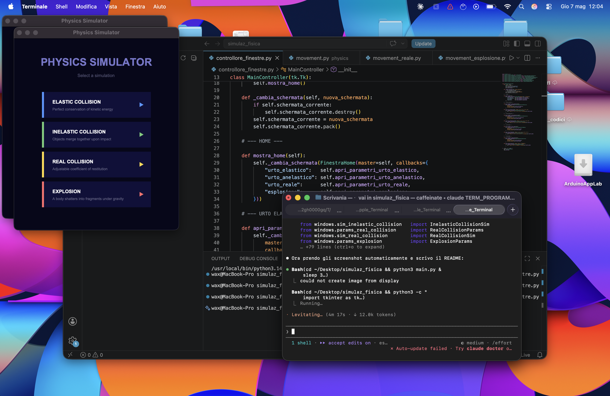
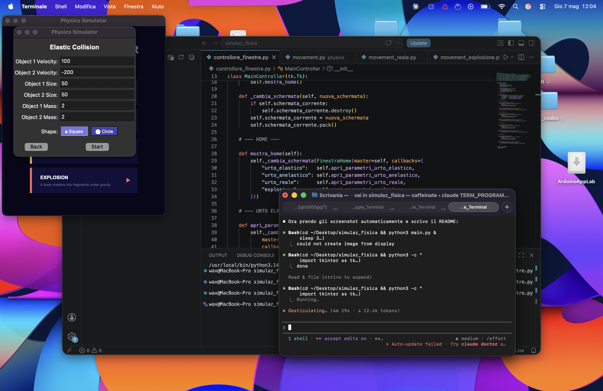
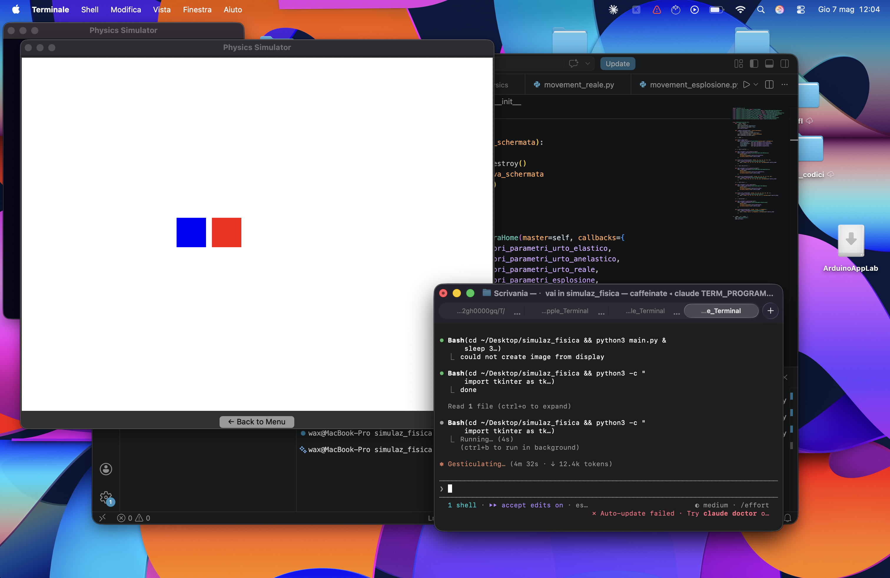
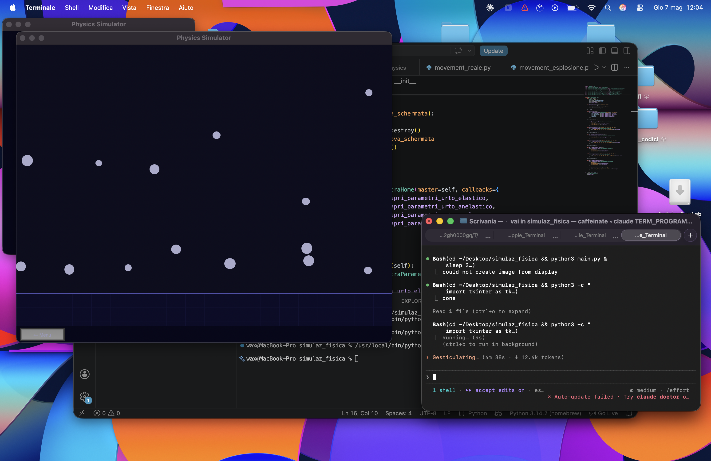

# Physics Simulator

A desktop physics simulator built with Python and Tkinter. Visualize classic mechanics scenarios — elastic and inelastic collisions, real-world impacts, and explosions — with configurable parameters and real-time animation.

---

## Screenshots

| Home | Parameters | Simulation |
|------|-----------|------------|
|  |  |  |

**Explosion simulation**



---

## Simulations

### Elastic Collision
Two objects collide with perfect conservation of kinetic energy and momentum.

```
v1' = ((m1 - m2) * v1 + 2 * m2 * v2) / (m1 + m2)
v2' = (2 * m1 * v1 + (m2 - m1) * v2) / (m1 + m2)
```

### Inelastic Collision
The objects merge upon impact and continue as a single body.

```
v' = (m1 * v1 + m2 * v2) / (m1 + m2)
```

### Real Collision
Impact with a tunable **coefficient of restitution** `e` (0 = perfectly inelastic, 1 = perfectly elastic).

```
v1' = (m1*v1 + m2*v2 + m2*e*(v2 - v1)) / (m1 + m2)
v2' = (m1*v1 + m2*v2 + m1*e*(v1 - v2)) / (m1 + m2)
```

### Explosion
A single body at the center of the canvas detonates and breaks into N fragments. Each fragment is subject to gravity, floor bouncing, and wall collisions.

---

## Features

- 4 independent physics simulations
- Configurable parameters: velocity, size, mass, coefficient of restitution, explosion force
- Shape selection: **square** or **circle**
- Real-time animation at ~33 fps
- Border clamping to keep objects always in frame
- Input validation with error messages

---

## Requirements

- Python 3.x
- Tkinter (included in the standard Python distribution)

No external dependencies.

---

## Installation & Run

```bash
git clone https://github.com/your-username/physics-simulator.git
cd physics-simulator
python main.py
```

---

## Project Structure

```
physics-simulator/
│
├── main.py                          # App entry point and navigation controller
│
├── windows/                         # UI screens
│   ├── home.py                      # Main menu
│   ├── params_elastic_collision.py  # Parameters for elastic collision
│   ├── params_inelastic_collision.py
│   ├── params_real_collision.py
│   ├── params_explosion.py
│   ├── sim_elastic_collision.py     # Simulation screens
│   ├── sim_inelastic_collision.py
│   ├── sim_real_collision.py
│   └── sim_explosion.py
│
├── physics/                         # Physics engines (pure logic, no UI)
│   ├── elastic.py
│   ├── inelastic.py
│   ├── real_collision.py
│   └── explosion.py
│
└── assets/
    └── screenshots/
```

---

## License

MIT License — feel free to use, modify and share.
